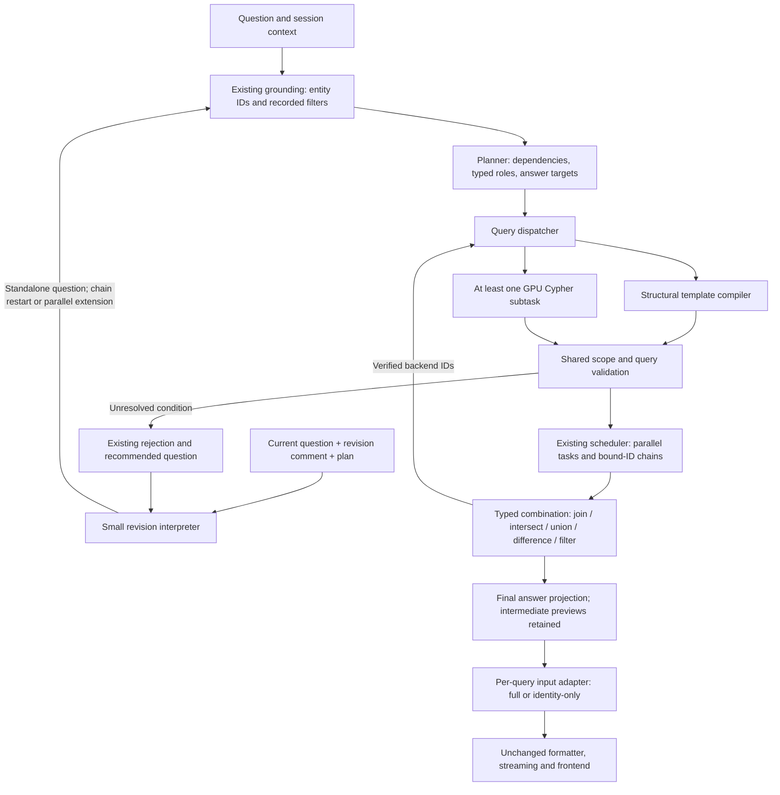
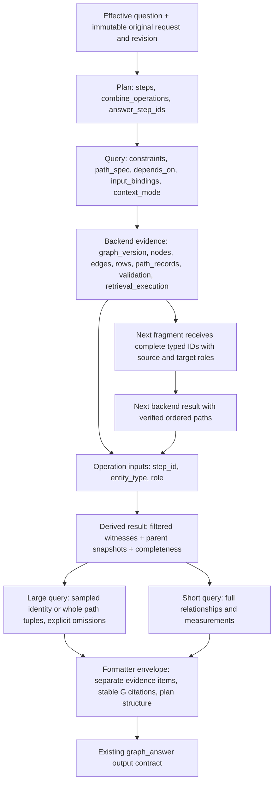

# Composable planner

Baseline: `4f2d0d32df64171e3cf51bfd0ff1b85176f7ab76` (dev agent only).

The planner emits normal query `steps`, optional `combine_operations`, and explicit
`answer_step_ids`. Operations become dependency-scheduled evidence checks using
existing preview, confirmation, revision and streaming endpoints. The twelve-check
budget includes result operations. `execution_mode` is derived from the graph.

Each `input_bindings` entry names a parent step, entity type, source role and target
role. Path fragments retain the existing two-to-four-role compiler; verified parent
IDs can anchor another fragment. Path joins preserve ordered witnesses. Ordinary
directed queries use source/target roles. IDs from formatter projections are rejected.

Result operations are union, intersection, difference, filter (left semijoin), and
ordered path join. Derived proof binds the operation and parent evidence snapshots;
readiness recomputes the result. Difference requires complete inputs. Incomplete
intersections remain partial. Final graph and formatter inputs use answer targets;
intermediate evidence remains in existing step previews. Source records are not edited.

Every fresh graph investigation designates a query for GPU participation. It is
validated by the ordinary guards; templates remain available on generation failure.
The specialized coloc route validates a GPU comparison candidate but executes only
its verified local template. Saved-result reads and confirmation reuse do not generate.

Revision interpretation makes one budgeted call to rewrite a complete question.
Chain changes restart; parallel changes plan the revised population and reuse only
fresh, checked, structurally identical queries. Widening never filters only old IDs.
Ambiguities return existing recovery messages and a recommended question; suggestions
are not automatically applied. No persistent delta/patch workflow is introduced.

Formatting input preparation is per query. Identity-only path views retain whole
verified connectivity witnesses without measurements, and explicitly disclose omitted
paths. Short branches retain full evidence. `ClaudeGateway.synthesize` and all output
contracts are unchanged; a regression checks its exact baseline source text.

## Validation

Synthetic result algebra, six-node path composition, typed dependency compilation,
projection isolation, mixed evidence modes and unchanged output-function tests are in
`tests_vnext/test_composable_planning.py`. Full agent tests distinguish known baseline
results-service fixture failures from new regressions. Live validation uses a separate
owner-only state directory and a $20 ledger, never the existing shared ledger.

## I/O flow

## Payload flow

Backend evidence remains authoritative for filtering, joins and counts. A compacted
view is never a dependency input. The shared task contract makes new templates and
result operations independent additions; revisions reuse ordinary planning instead
of introducing another execution engine.

Explicit connected-path requests use `chain_drafting.py`: one complete path draft
(up to sixteen roles) becomes bounded fragments and cumulative joins. Node-role
inequalities and reverse edge spelling are canonicalized without changing their
meaning. Unverified fragments and missing ancestor paths block the final result.
The existing recovery payload explains path-condition failures and supplies a
complete retry question; it never executes a suggested relaxation.

The standalone revised question supplies execution scope; the raw original request
and revision instruction remain recorded separately. This is necessary for removing
an old filter without having the grounding layer reapply it.
